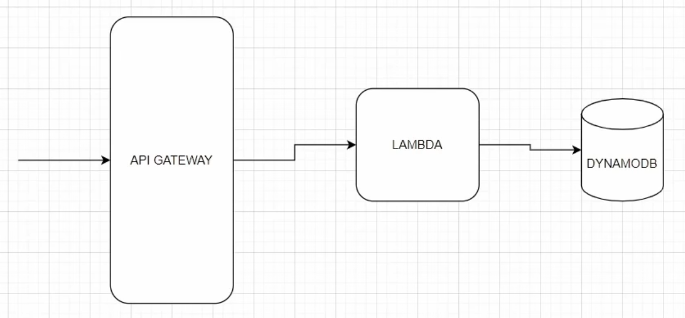

## go-serverless-crud

This project explores implementing a AWS serverless stack in Go. The goal of this project is to determine the ease of 
use compared to more commonly used enterprise grade backend frameworks.

The basic architecture of this project is diagrammed below:

This project was initialized using `go mod init`

